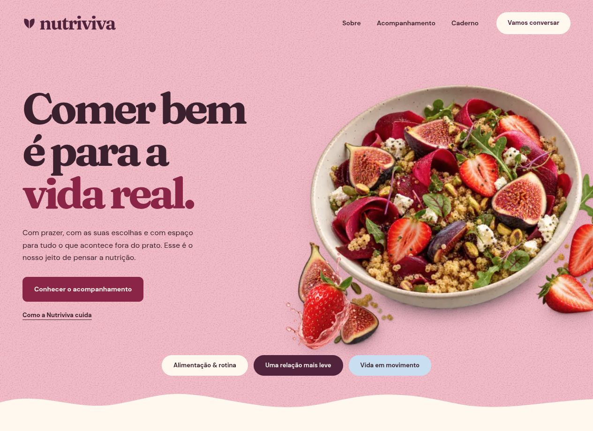

<div align="center">

# Nutriviva

Comer bem é para a vida real.

Uma experiência digital de nutrição, comida e cotidiano.

[Explorar o código](https://github.com/GisellyPereira/project-lo) · [Direção visual](docs/visual-direction.md)

</div>



## Sobre o projeto

Nutriviva é um site conceitual de portfólio que apresenta uma abordagem de acompanhamento nutricional centrada na rotina e nas preferências de cada pessoa. Reúne apresentação da marca, caminhos de acompanhamento, um caderno de leituras e uma experiência de contato.

A identidade combina rosa pétala, ameixa, creme, lilás e azul suave. Fotografias de alimentos, recortes de frutas, ondas orgânicas e textura de papel dão continuidade à composição. Fraunces aparece nos títulos e na marca; DM Sans acompanha a leitura e a navegação.

## O que você encontra

- **Acompanhamento interativo:** três caminhos com abas acessíveis, seleção por toque e navegação por teclado.
- **Caderno editorial:** uma leitura em destaque, duas leituras de apoio e páginas próprias para cada artigo.
- **Contato no seu tempo:** formulário validado, rascunho local e uma mensagem que pode ser salva no dispositivo.
- **Rolagem suave:** Lenis em toda a aplicação, respeitando a preferência por movimento reduzido.
- **Interface responsiva:** composições adaptadas para celular, tablet e desktop.
- **Assets locais:** fotografias em WebP, fontes servidas pela aplicação e marca vetorial.

## Tecnologias

| Tecnologia | Uso |
| --- | --- |
| Next.js 16 · App Router | Rotas, metadados, imagens e geração estática |
| React · TypeScript | Componentes e interações tipadas |
| CSS | Identidade visual, layouts e responsividade |
| Lenis | Rolagem suave e navegação por âncoras |
| Fraunces · DM Sans | Tipografia local |

## Páginas

| Endereço | Conteúdo |
| --- | --- |
| `/` | Apresentação da Nutriviva |
| `/sobre` | Abordagem e identidade |
| `/servicos` | Caminhos de acompanhamento e perguntas |
| `/blog` | Caderno de ideias |
| `/blog/[slug]` | Leitura de cada artigo |
| `/contato` | Preparação da primeira conversa |

Os endereços antigos dos artigos possuem redirecionamentos para as leituras atuais.

## Rodar localmente

Requer **Node.js 22.6 ou superior** e npm.

```bash
npm ci
npm run dev
```

Abra [localhost:3000](http://localhost:3000). Para usar outra porta:

```bash
npm run dev -- --port 3021
```

Para verificar e executar a versão de produção, rode os comandos em sequência:

```bash
npm run build
npm run typecheck
npm start
```

## Organização

```text
app/
  components/    Marca, navegação, seções e formulários
  lib/           Conteúdo dos acompanhamentos e artigos
  globals.css    Identidade visual e regras responsivas
public/
  images/        Fotografias, originais e assets vetoriais
docs/
  visual-direction.md
  preview-home.png
```

## Imagens e autoria

Os PNGs originais estão preservados em [public/images](public/images), junto das versões WebP usadas no site. A [direção visual](docs/visual-direction.md) reúne o catálogo de imagens, a direção dos prompts e os créditos do acervo complementar.

Nutriviva é uma marca fictícia e as imagens geradas são ilustrativas. O formulário prepara um arquivo de texto no dispositivo, sem envio ou armazenamento em servidor. O conteúdo editorial não representa um plano alimentar individualizado.

Criado por [Giselly Pereira](https://github.com/GisellyPereira).
